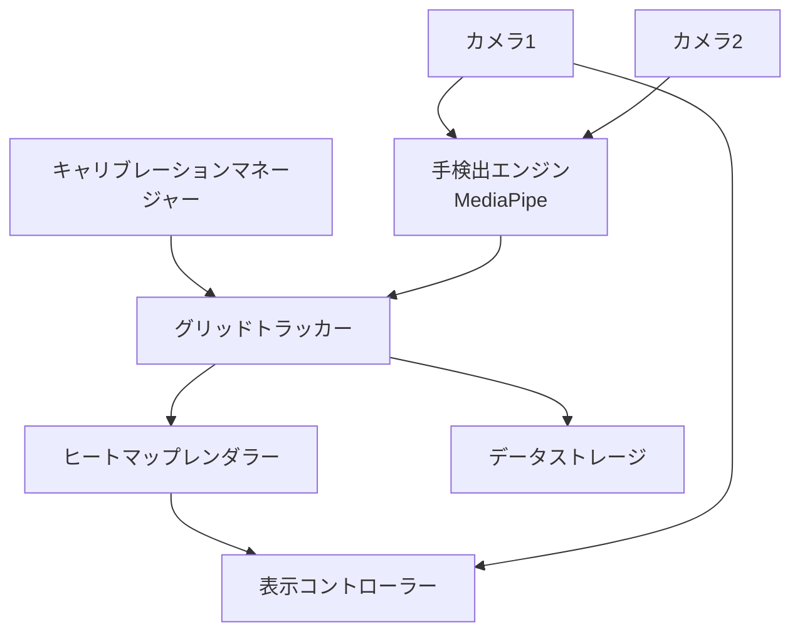
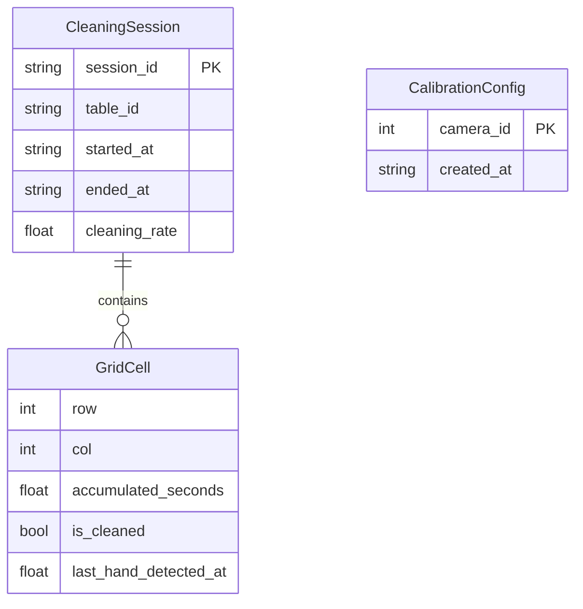
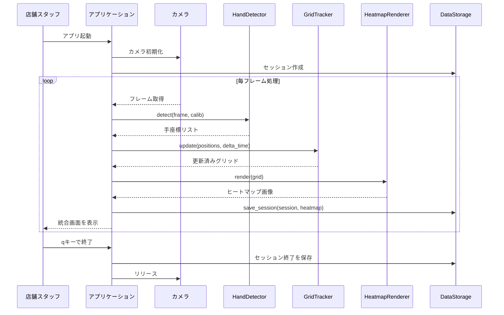
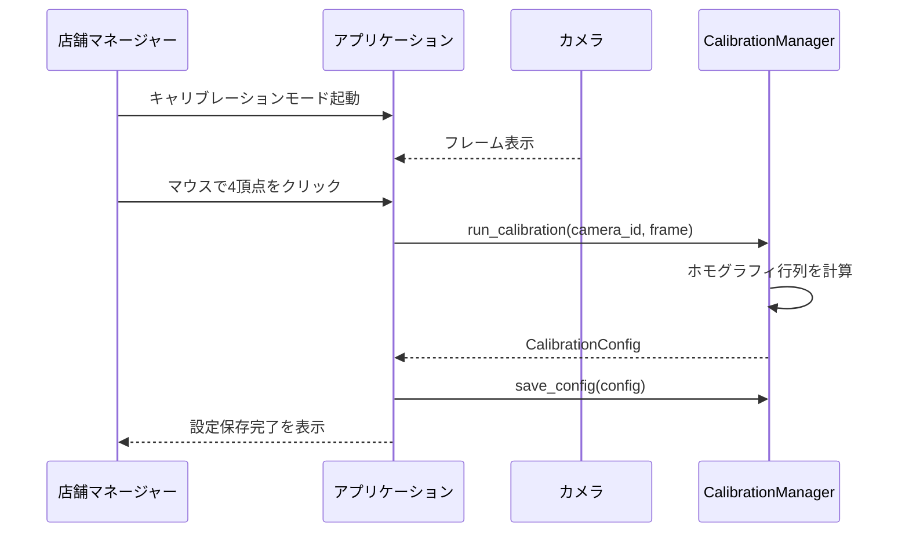
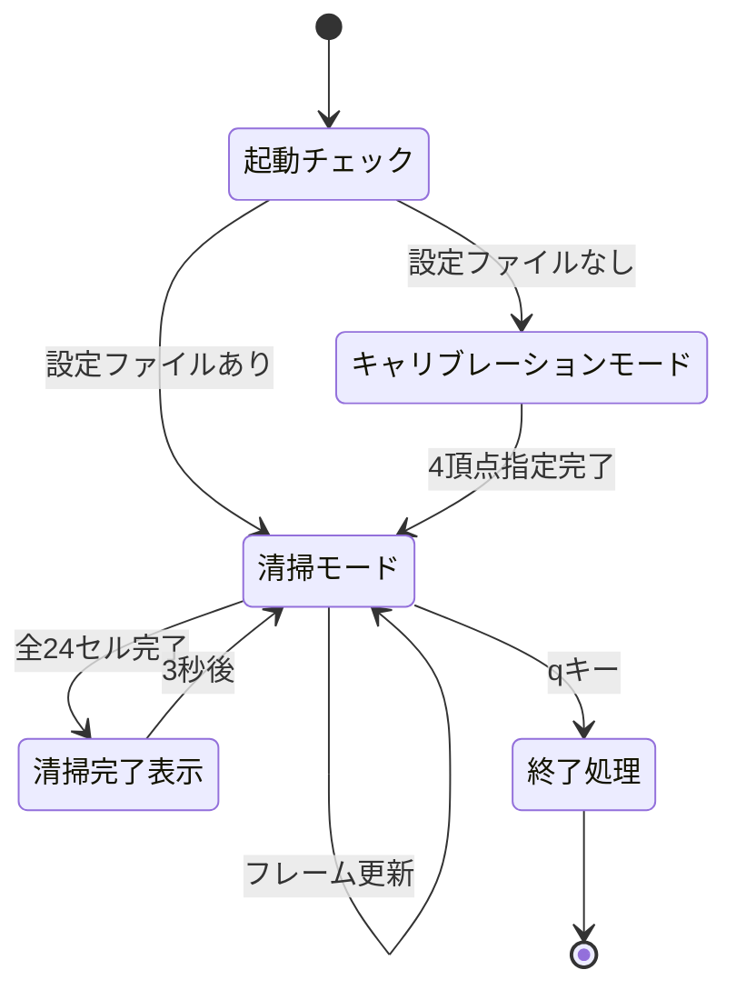

# 機能設計書 (Functional Design Document)

## システム構成図



## 技術スタック

| 分類 | 技術 | 選定理由 |
|------|------|----------|
| 言語 | Python 3.12 | - |
| 映像処理 | OpenCV 4.x | 画像処理の豊富な機能セットと実績 |
| 手検出 | MediaPipe | 手の骨格座標検出 |
| 数値演算 | NumPy 2.x | 高速な数値演算ライブラリ |
| ヒートマップ | matplotlib 3.x | ヒートマップ・カラーマップ生成が容易 |
| パッケージ管理 | uv 0.5.x | - |

## データモデル定義

### エンティティ: GridCell（グリッドセル）

```python
@dataclass
class GridCell:
    row: int                    # 行インデックス (0-1, 縦2分割)
    col: int                    # 列インデックス (0-11, 横12分割)
    accumulated_seconds: float  # 手が存在した累積時間（秒）
    is_cleaned: bool            # 清掃完了判定 (accumulated_seconds >= 5.0)
    last_hand_detected_at: float | None  # 最後に手を検出したタイムスタンプ (Unix時間)
```

**制約**:
- グリッドは固定サイズ: 縦2 × 横12 = 24セル
- `is_cleaned` は `accumulated_seconds >= 5.0` のとき True
- `accumulated_seconds` は連続して手が存在した場合のみ加算（フレーム間隔を考慮）

---

### エンティティ: HandPosition（手座標）

```python
@dataclass
class HandPosition:
    x_normalized: float   # テーブル座標系でのX位置 (0.0-1.0, 左端=0)
    y_normalized: float   # テーブル座標系でのY位置 (0.0-1.0, 上端=0)
    timestamp: float      # 検出時のUnixタイムスタンプ
    camera_id: int        # 検出したカメラのID (0 or 1)
    confidence: float     # 検出信頼度 (0.0-1.0)
```

---

### エンティティ: CalibrationConfig（キャリブレーション設定）

```python
@dataclass
class CalibrationConfig:
    camera_id: int                          # カメラID
    table_corners: list[tuple[int, int]]    # カメラ画像上の4頂点 [(x1,y1), (x2,y2), (x3,y3), (x4,y4)]
    homography_matrix: np.ndarray | None    # ホモグラフィ変換行列 (3x3)
    created_at: str                         # ISO 8601形式
```

**制約**:
- `table_corners` は時計回りで指定: 左上→右上→右下→左下
- `homography_matrix` はキャリブレーション完了後に自動計算

---

### エンティティ: CleaningSession（清掃セッション）

```python
@dataclass
class CleaningSession:
    session_id: str                 # YYYYMMDD_HHMMSS 形式
    table_id: str                   # テーブル識別子（例: "table_01"）
    started_at: str                 # ISO 8601形式
    ended_at: str | None            # ISO 8601形式（セッション終了時に設定）
    grid_cells: list[list[GridCell]]  # [row][col] の2次元配列 (2×12)
    cleaning_rate: float            # 清掃完了率 (完了セル数/24)
```

---

### ER図



---

## コンポーネント設計

### CameraManager（カメラマネージャー）

**責務**:
- 複数カメラの初期化・接続管理
- フレームの取得（シングル/デュアルカメラ）
- カメラ切断時の自動再接続

**インターフェース**:

```python
class CameraManager:
    def __init__(self, camera_ids: list[int]) -> None: ...
    def get_frames(self) -> dict[int, np.ndarray]:
        """カメラIDをキー、フレームを値とした辞書を返す"""
    def is_connected(self, camera_id: int) -> bool: ...
    def release(self) -> None: ...
```

**依存関係**:
- OpenCV (`cv2.VideoCapture`)

---

### CalibrationManager（キャリブレーションマネージャー）

**責務**:
- マウス操作によるテーブル4頂点の指定UI
- ホモグラフィ変換行列の計算・保存・読み込み
- カメラ座標→テーブル正規化座標への変換

**インターフェース**:

```python
class CalibrationManager:
    def run_calibration(self, camera_id: int, frame: np.ndarray) -> CalibrationConfig:
        """インタラクティブなキャリブレーションUIを起動し、設定を返す"""
    def load_config(self, camera_id: int) -> CalibrationConfig | None: ...
    def save_config(self, config: CalibrationConfig) -> None: ...
    def transform_point(self, config: CalibrationConfig, px: int, py: int) -> tuple[float, float]:
        """カメラ画素座標 → テーブル正規化座標(0-1)に変換"""
```

**依存関係**:
- OpenCV (ホモグラフィ計算: `cv2.findHomography`, マウスイベント)
- NumPy

---

### HandDetector（手検出エンジン）

**責務**:
- 映像フレームからMediaPipeで手の座標を検出
- キャリブレーション設定を使いテーブル正規化座標に変換

**インターフェース**:

```python
class HandDetector:
    def __init__(self) -> None: ...
    def detect(self, frame: np.ndarray, camera_id: int, calib: CalibrationConfig) -> list[HandPosition]:
        """フレームから手座標リストを返す（検出なしの場合は空リスト）"""
    def draw_landmarks(self, frame: np.ndarray, positions: list[HandPosition]) -> np.ndarray:
        """検出結果を映像フレームに描画して返す"""
```

**依存関係**:
- MediaPipe (`mediapipe.solutions.hands`)
- CalibrationManager

---

### GridTracker（グリッドトラッカー）

**責務**:
- HandPositionをグリッドセルに変換
- 各セルの累積清掃時間を更新
- 清掃完了判定（5秒閾値）
- マルチカメラの検出結果を統合（論理和）

**インターフェース**:

```python
class GridTracker:
    ROWS = 2
    COLS = 12
    CLEAN_THRESHOLD_SECONDS = 5.0

    def __init__(self) -> None: ...
    def update(self, hand_positions: list[HandPosition], delta_time: float) -> None:
        """手座標と経過時間(秒)でグリッドを更新"""
    def get_grid(self) -> list[list[GridCell]]: ...
    def get_cleaning_rate(self) -> float:
        """清掃完了率 = 完了セル数 / 24"""
    def reset(self) -> None:
        """清掃セッション開始時にグリッドをリセット"""
    def _position_to_cell(self, position: HandPosition) -> tuple[int, int]:
        """正規化座標 → (row, col) に変換"""
```

**依存関係**:
- HandPosition データクラス

---

### HeatmapRenderer（ヒートマップレンダラー）

**責務**:
- グリッド状態を色分けした画像として生成
- 清掃済み(緑)・清掃中(黄)・未清掃(赤)の3段階表示

**インターフェース**:

```python
class HeatmapRenderer:
    def __init__(self, cell_width_px: int = 80, cell_height_px: int = 120) -> None: ...
    def render(self, grid: list[list[GridCell]]) -> np.ndarray:
        """グリッド状態をOpenCV画像(ndarray)として返す"""
```

**カラーマッピング**:

| 状態 | 条件 | 色(BGR) |
|------|------|---------|
| 清掃済み | `accumulated_seconds >= 5.0` | 緑 `(0, 200, 0)` |
| 清掃中 | `0 < accumulated_seconds < 5.0` | 黄 `(0, 200, 200)` |
| 未清掃 | `accumulated_seconds == 0` | 赤 `(0, 0, 200)` |

**依存関係**:
- OpenCV, NumPy

---

### DisplayController（表示コントローラー）

**責務**:
- カメラ映像・ヒートマップ・清掃率の統合表示
- キー入力によるアプリケーション制御（qで終了）
- 清掃完了時のアラート表示

**インターフェース**:

```python
class DisplayController:
    def __init__(self, window_name: str = "CleanTrack") -> None: ...
    def show(
        self,
        frames: dict[int, np.ndarray],
        heatmap: np.ndarray,
        cleaning_rate: float
    ) -> None: ...
    def wait_key(self, delay_ms: int = 1) -> str | None:
        """押されたキーを返す（なければNone）"""
    def destroy(self) -> None: ...
```

---

### DataStorage（データストレージ）

**責務**:
- 清掃セッションのJSON保存・読み込み
- ヒートマップ画像の保存
- 都度保存による異常終了時のデータ保全

**インターフェース**:

```python
class DataStorage:
    BASE_DIR = "data/sessions"

    def __init__(self) -> None: ...
    def create_session(self, table_id: str) -> CleaningSession: ...
    def save_session(self, session: CleaningSession, heatmap_img: np.ndarray) -> None:
        """data/sessions/{session_id}/session.json と heatmap.png を保存"""
    def load_session(self, session_id: str) -> CleaningSession | None: ...
```

---

## ユースケース図

### ユースケース1: 清掃セッションの実行



---

### ユースケース2: キャリブレーション設定



---

## アルゴリズム設計

### グリッドセル更新アルゴリズム

**目的**: 手の検出結果を24グリッドに反映し、5秒累積で清掃完了を判定する

#### ステップ1: 座標変換

手の正規化座標 `(x, y)` を `(row, col)` に変換:

```python
col = int(x * 12)  # 0-11 (横12分割)
row = int(y * 2)   # 0-1  (縦2分割)
```

境界値の処理: `col = min(col, 11)`, `row = min(row, 1)`

#### ステップ2: 累積時間の更新

各フレームで検出された手の座標に対応するセルを更新:

```python
def update(self, hand_positions: list[HandPosition], delta_time: float) -> None:
    # 今フレームで手が検出されたセルのセット
    detected_cells = set()
    for pos in hand_positions:
        row, col = self._position_to_cell(pos)
        detected_cells.add((row, col))

    # 検出されたセルのみ累積時間を加算
    for row, col in detected_cells:
        cell = self.grid[row][col]
        cell.accumulated_seconds += delta_time
        cell.last_hand_detected_at = time.time()
        cell.is_cleaned = cell.accumulated_seconds >= self.CLEAN_THRESHOLD_SECONDS
```

#### ステップ3: マルチカメラ統合

2台のカメラから取得した `HandPosition` リストをマージして `update()` に渡す（論理和）:

```python
all_positions = camera1_positions + camera2_positions
tracker.update(all_positions, delta_time)
```

同一セルへの重複検出は `detected_cells` セットにより1フレームあたり1回のみ加算。

---

## UI設計

### 表示レイアウト

```
┌─────────────────────────────────────────────────┐
│ CleanTrack - Table 01                            │
├──────────────────────┬──────────────────────────┤
│  Camera 1 (映像)     │  Camera 2 (映像)         │
│  640×480             │  640×480                 │
│  [手検出バウンディン  │  [手検出バウンディング   │
│   グボックス表示]     │   ボックス表示]           │
├──────────────────────┴──────────────────────────┤
│  ヒートマップ (960×240px)                        │
│  ┌──┬──┬──┬──┬──┬──┬──┬──┬──┬──┬──┬──┐  行0  │
│  │  │  │  │  │  │  │  │  │  │  │  │  │       │
│  ├──┼──┼──┼──┼──┼──┼──┼──┼──┼──┼──┼──┤  行1  │
│  │  │  │  │  │  │  │  │  │  │  │  │  │       │
│  └──┴──┴──┴──┴──┴──┴──┴──┴──┴──┴──┴──┘       │
├─────────────────────────────────────────────────┤
│  清掃完了率: 12/24 (50.0%)   [q: 終了]           │
└─────────────────────────────────────────────────┘
```

### カラーコーディング（ヒートマップ）

| 状態 | 色 | 条件 |
|------|----|------|
| 清掃済み | 緑 | accumulated_seconds >= 5.0秒 |
| 清掃中 | 黄 | 0 < accumulated_seconds < 5.0秒 |
| 未清掃 | 赤 | accumulated_seconds == 0 |

### 清掃完了アラート

全24セルが清掃完了した際、画面中央に半透明オーバーレイで「清掃完了！」を3秒間表示する。

---

## ファイル構造

**設定ファイル保存形式**:

```
config/
└── calibration_{camera_id}.json   # カメラごとのキャリブレーション設定
```

```json
{
  "camera_id": 0,
  "table_corners": [[100, 80], [540, 80], [540, 400], [100, 400]],
  "homography_matrix": [[...], [...], [...]],
  "created_at": "2026-03-14T10:00:00+09:00"
}
```

**清掃セッション保存形式**:

```
data/
└── sessions/
    └── 20260314_100000/
        ├── session.json    # セッションデータ
        └── heatmap.png     # 最終ヒートマップ画像
```

```json
{
  "session_id": "20260314_100000",
  "table_id": "table_01",
  "started_at": "2026-03-14T10:00:00+09:00",
  "ended_at": "2026-03-14T10:05:30+09:00",
  "cleaning_rate": 0.875,
  "grid_cells": [
    [
      {"row": 0, "col": 0, "accumulated_seconds": 7.2, "is_cleaned": true},
      {"row": 0, "col": 1, "accumulated_seconds": 2.1, "is_cleaned": false}
    ]
  ]
}
```

---

## 画面遷移図



---

## エラーハンドリング

### エラーの分類

| エラー種別 | 処理 | ユーザーへの表示 |
|-----------|------|-----------------|
| カメラ未接続 | 再接続を3秒間隔で最大5回試みる。失敗時は終了 | 「カメラ{ID}に接続できません。再試行中...」 |
| キャリブレーション設定ファイル不正 | 設定を破棄し再キャリブレーションを促す | 「設定ファイルが破損しています。再設定が必要です。」 |
| データ保存失敗 | エラーをログに記録し処理継続（次フレームで再試行） | ログファイルにのみ記録、画面表示なし |
| MediaPipe初期化失敗 | アプリケーションを終了 | 「手検出エンジンの初期化に失敗しました。」 |
| メモリ不足 | アプリケーションを終了、データを保存 | 「メモリが不足しています。データを保存して終了します。」 |

---

## テスト戦略

### ユニットテスト

- `GridTracker.update()`: 累積時間の加算と清掃完了判定
- `GridTracker._position_to_cell()`: 境界値を含む座標変換
- `CalibrationManager.transform_point()`: ホモグラフィ変換の精度
- `DataStorage.save_session()` / `load_session()`: JSON の読み書き整合性

### 統合テスト

- 動画ファイルを入力として清掃セッションが正常に記録されること
- キャリブレーション設定の保存・再読み込み後も変換精度が維持されること
- 2台カメラの検出結果が正しく統合されること

### E2Eテスト

- 実際のカメラを使い、手を5秒以上かざしたセルが清掃済みと判定されること
- 全セル完了時にアラートが表示されること
- qキーでセッションデータが保存されて終了すること
