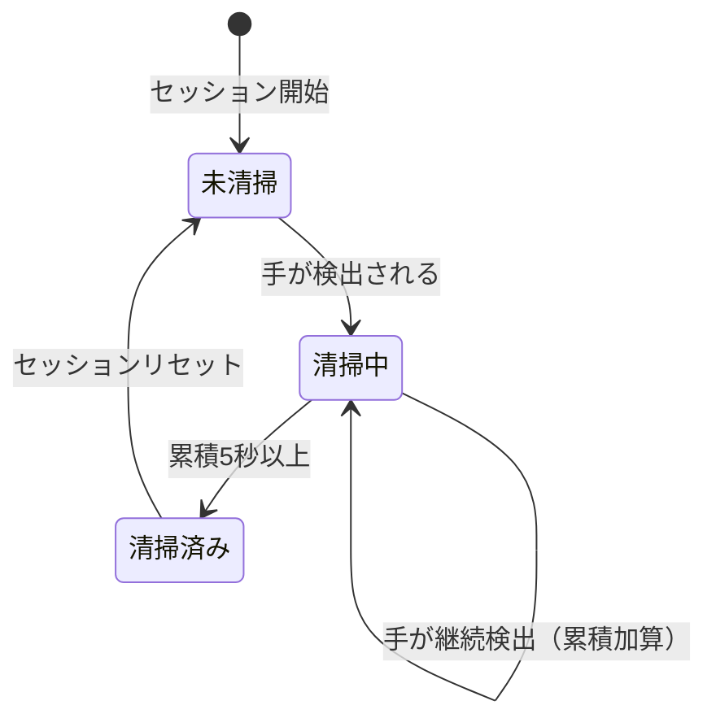

# プロジェクト用語集 (Glossary)

## 概要

このドキュメントは、CleanTrack プロジェクト内で使用される用語の定義を管理します。

**更新日**: 2026-03-14

---

## ドメイン用語

プロジェクト固有のビジネス概念や機能に関する用語。

### 清掃セッション

**定義**: テーブル1枚に対する1回の清掃作業の開始から終了までの単位。

**説明**: アプリケーション起動後、スタッフがテーブルを拭き始めてから `q` キーで終了するまでの期間。セッション単位でグリッド状態とヒートマップ画像がファイルに保存される。

**関連用語**: グリッドセル、清掃完了率、ヒートマップ

**使用例**:
- 「1回の清掃セッションのデータは `data/sessions/20260314_100000/` に保存される」
- 「セッション開始時に全グリッドセルをリセットする」

**英語表記**: Cleaning Session

---

### グリッドセル

**定義**: テーブル表面を縦2×横12に分割した合計24個のマス目の1つ。

**説明**: テーブル（縦300mm×横1800mm）を均等分割した論理的な単位。各セルは手の累積滞在時間を記録し、5秒以上で清掃済みと判定される。コード上は `GridCell` dataclass で表現される。

**関連用語**: ヒートマップ、清掃完了判定、累積清掃時間

**使用例**:
- 「グリッドセル(row=0, col=5)の累積清掃時間が5秒を超えたため、清掃済みに変わった」
- 「24個のグリッドセルすべてが清掃済みになると清掃完了アラートを表示する」

**英語表記**: Grid Cell

---

### 累積清掃時間

**定義**: 特定のグリッドセル上に手が存在し続けた時間の合計（秒）。

**説明**: フレームごとに手が検出されているセルに `delta_time`（前フレームからの経過時間）を加算して計算する。手が離れた後も累積値はリセットされず保持される。清掃完了閾値（5.0秒）との比較に使用。

**関連用語**: グリッドセル、清掃完了判定、delta_time

**英語表記**: Accumulated Cleaning Time

---

### 清掃完了判定

**定義**: グリッドセルの累積清掃時間が閾値（5.0秒）以上になった状態の判定。

**説明**: `GridCell.accumulated_seconds >= 5.0` を満たした時点で `is_cleaned = True` に設定される。一度清掃済みになったセルは、同一セッション内でリセットされない。

**関連用語**: 累積清掃時間、グリッドセル

**英語表記**: Cleaning Completion Judgment

---

### 清掃完了率

**定義**: 全グリッドセル(24個)のうち清掃済みセルの割合（0.0〜1.0）。

**説明**: `清掃済みセル数 / 24` で計算。画面上に「12/24 (50.0%)」形式で表示される。全セルが清掃済み（1.0）になるとアラートが表示される。

**計算式**: `cleaning_rate = 清掃済みセル数 / (ROWS × COLS)` = `清掃済みセル数 / 24`

**関連用語**: グリッドセル、清掃完了判定

**英語表記**: Cleaning Rate

---

### ヒートマップ

**定義**: 24個のグリッドセルの清掃状態を色で表現した画像。

**説明**: 各セルの状態を3色でコーディングした可視化画像（960×240px）。清掃済み=緑、清掃中=黄、未清掃=赤で表示。リアルタイムに更新される。

**カラーコーディング**:
- 緑 `(0, 200, 0)`: 清掃済み（累積5秒以上）
- 黄 `(0, 200, 200)`: 清掃中（0秒超〜5秒未満）
- 赤 `(0, 0, 200)`: 未清掃（0秒）

**関連用語**: グリッドセル、清掃完了判定

**英語表記**: Heatmap

---

### キャリブレーション

**定義**: カメラ映像上のピクセル座標をテーブルの物理座標系に変換するための設定作業。

**説明**: カメラの設置位置・角度に依存せず正確な清掃エリアを検出するために必要な初期設定。マウスで映像上のテーブル4頂点をクリックし、ホモグラフィ行列を算出する。設定は `config/calibration_{camera_id}.json` に保存される。

**関連用語**: ホモグラフィ変換、テーブル正規化座標

**英語表記**: Calibration

---

### テーブル正規化座標

**定義**: テーブル表面を左上(0,0)・右下(1,1)とした座標系。

**説明**: カメラ映像（ピクセル座標）からホモグラフィ変換で変換された後の座標。この正規化座標を使ってグリッドセルの位置を特定する。`x=0.5, y=0.5` はテーブルの中央を意味する。

**計算方法**: キャリブレーションで算出したホモグラフィ行列を用いてカメラ座標から変換。

**関連用語**: キャリブレーション、ホモグラフィ変換、グリッドセル

**英語表記**: Normalized Table Coordinates

---

## 技術用語

プロジェクトで使用している技術・フレームワーク・ツールに関する用語。

### OpenCV

**定義**: オープンソースのコンピュータビジョンライブラリ。

**本プロジェクトでの用途**: カメラ映像の取得・フレーム処理・ホモグラフィ変換・画面表示・マウスイベント処理・PNG画像保存。

**バージョン**: 4.x

**関連ドキュメント**: `docs/architecture.md`

---

### MediaPipe

**定義**: Googleが提供するリアルタイム機械学習パイプラインフレームワーク。

**本プロジェクトでの用途**: `mediapipe.solutions.hands` モジュールを使用し、カメラフレームから手の骨格座標を検出する。21個のランドマーク点を検出し、その中から手の位置を算出。

**バージョン**: 最新安定版

**関連ドキュメント**: `docs/functional-design.md`, `src/detection/hand_detector.py`

---

### ホモグラフィ変換

**定義**: 2つの平面間の射影変換を行う数学的手法（3×3行列）。

**本プロジェクトでの用途**: カメラ映像上の台形に歪んだテーブル領域を、正規化されたテーブル座標系（矩形）に変換する。`cv2.findHomography()` で4点対応から行列を算出し、`cv2.perspectiveTransform()` で座標変換を実行。

**関連用語**: キャリブレーション、テーブル正規化座標

**英語表記**: Homography Transformation

---

### NumPy

**定義**: Pythonの高速数値演算ライブラリ。

**本プロジェクトでの用途**: ホモグラフィ行列（ndarray）の演算、OpenCV映像フレームのデータ形式（ndarray）の操作、ヒートマップ画像生成。

**バージョン**: 2.x

---

### uv

**定義**: Rustで書かれた高速なPythonパッケージ管理ツール。

**本プロジェクトでの用途**: 依存パッケージのインストール（`uv sync`）、仮想環境管理、スクリプト実行（`uv run python ...`）。`uv.lock` で依存関係を固定し、環境の再現性を確保。

**バージョン**: 0.5.x

---

## 略語・頭字語

### PoC

**正式名称**: Proof of Concept

**意味**: 概念実証。アイデアや技術の実現可能性を検証するための試作的な実装。

**本プロジェクトでの使用**: 本プロジェクト全体がPoCとして位置づけられている。データ保存先はローカルPCのみ、認証なしのシンプルな構成が許容される理由。

---

### FPS

**正式名称**: Frames Per Second

**意味**: 映像の1秒あたりのフレーム数。

**本プロジェクトでの使用**: パフォーマンス要件「30fps以上の映像をリアルタイム処理」で使用。

---

### BGR

**正式名称**: Blue-Green-Red

**意味**: OpenCVが使用する色チャンネルの順序。一般的なRGBとは順序が逆。

**本プロジェクトでの使用**: `HeatmapRenderer` でセルの色を指定する際の形式。例: 緑 = `(0, 200, 0)` (B=0, G=200, R=0)。

---

## アーキテクチャ用語

### パイプラインアーキテクチャ

**定義**: データが一連の処理ステップを順番に通過するアーキテクチャパターン。

**本プロジェクトでの適用**: 映像フレームが `CameraManager → HandDetector → GridTracker → HeatmapRenderer → DisplayController` の順に処理される。

**関連コンポーネント**: CameraManager, HandDetector, GridTracker, HeatmapRenderer, DisplayController

---

### レイヤードアーキテクチャ

**定義**: システムを責務ごとに分離した階層（レイヤー）に分けるアーキテクチャパターン。

**本プロジェクトでの適用**: 入力→検出→ビジネスロジック→出力→データの5層に分離。上位レイヤーから下位レイヤーへの一方向依存のみ許可。

**図解**:

```
入力 (input)   → CameraManager
検出 (detection) → HandDetector, CalibrationManager
ビジネス (tracking) → GridTracker
出力 (output)   → HeatmapRenderer, DisplayController
データ (storage) → DataStorage
```

---

## ステータス・状態

### グリッドセルの清掃状態

| ステータス | 意味 | 遷移条件 | 次の状態 |
|----------|------|---------|---------|
| 未清掃 | `accumulated_seconds == 0` | 手が検出される | 清掃中 |
| 清掃中 | `0 < accumulated_seconds < 5.0` | 累積が5秒に達する | 清掃済み |
| 清掃済み | `accumulated_seconds >= 5.0` | セッションリセット | 未清掃 |

**状態遷移図**:



---

### アプリケーション動作状態

| ステータス | 意味 | 遷移条件 |
|----------|------|---------|
| キャリブレーションモード | テーブル4頂点を設定中 | 設定ファイルが存在しない場合に起動 |
| 清掃モード | 通常の清掃監視実行中 | キャリブレーション完了後、または設定ファイル読み込み後 |
| 清掃完了表示 | 全24セル清掃済みのアラート表示中 | 清掃完了率が1.0になった時 |
| 終了処理 | セッションデータ保存・リソース解放中 | `q` キー押下後 |

---

## データモデル用語

### GridCell

**定義**: グリッドセルの状態を表すdataclass。

**主要フィールド**:

- `row`: 行インデックス（0または1）
- `col`: 列インデックス（0〜11）
- `accumulated_seconds`: 累積清掃時間（秒）
- `is_cleaned`: 清掃完了フラグ（`accumulated_seconds >= 5.0`）
- `last_hand_detected_at`: 最後の手検出タイムスタンプ（Unix時間）

**関連エンティティ**: CleaningSession

---

### CleaningSession

**定義**: 清掃セッション全体のデータを表すdataclass。

**主要フィールド**:

- `session_id`: `YYYYMMDD_HHMMSS` 形式のセッション識別子
- `table_id`: テーブル識別子（例: `"table_01"`）
- `started_at` / `ended_at`: セッション開始・終了時刻（ISO 8601）
- `grid_cells`: `GridCell` の2次元配列（2×12）
- `cleaning_rate`: 清掃完了率（0.0〜1.0）

**関連エンティティ**: GridCell

---

### CalibrationConfig

**定義**: カメラキャリブレーション設定を表すdataclass。

**主要フィールド**:

- `camera_id`: カメラID（0 または 1）
- `table_corners`: カメラ映像上のテーブル4頂点（時計回り）
- `homography_matrix`: ホモグラフィ変換行列（3×3 NumPy配列）
- `created_at`: 設定作成日時（ISO 8601）

---

## 計算・アルゴリズム

### グリッドセル位置算出

**定義**: テーブル正規化座標（0.0〜1.0）からグリッドセルの(row, col)を算出する計算。

**計算式**:

```
col = min(int(x_normalized * 12), 11)   # 横12分割
row = min(int(y_normalized * 2), 1)     # 縦2分割
```

**実装箇所**: `src/tracking/grid_tracker.py` の `_position_to_cell()`

**例**:

```
入力: x_normalized=0.5, y_normalized=0.3
出力: row=0, col=6  （テーブル上半分・横中央）
```

---

### delta_time

**定義**: 直前フレームの処理完了から現フレームの処理完了までの経過時間（秒）。

**説明**: `time.time()` の差分で算出。累積清掃時間の加算に使用する。フレームレートが不安定な環境でも正確な時間計測ができる。

**使用箇所**: `GridTracker.update()` の引数

**例**:

```
30fps環境: delta_time ≈ 0.033秒
処理が重い場合: delta_time ≈ 0.05〜0.1秒
```
